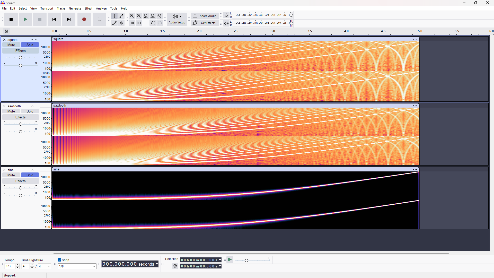

Sine sweep sounds normal. This is because sine is a single component, so it always stays below the Nyquist frequency. Therefore, no aliasing. 

Saw and square sweep, towards the higher end of the sweep, have distortions. These distortions occur because of aliasing. Saw and square waves are made of multiple harmonic frequencies that are multiples of the fundamental frequency. Once any harmonic exceeds the Nyquist frequency, it folds back into the audible band at sample_rate - f_harmonic, which is a non-harmonic frequency. If the harmonic carries a lot of energy because it is a lower multiple of the fundamental, then the dissonance becomes audible. 

In the spectrograms, descending arcs can be seen crossing the rising harmonics. These are the folds reflecting back in. These arcs are descending because it is the result of the subtraction of f_s - f. As the harmonic increases, the alias decreases, hence the descending arcs. 

The fix for this is either band-limiting the signal (generating the waveform without the harmonics higher than the Nyquist frequency) or oversampling (more harmonics fit without folding, the harmonics that do fold can be filtered out without affecting the reproduction of the signal).

*Spectrograms of the 20 Hz to 20 kHz sweeps. **Square** (top): odd harmonics only, spaced fan; each reflects off Nyquist and sweeps back down as descending arcs. **Sawtooth** (middle): all harmonics, so the fan is denser and the alias lattice is busier. **Sine** (bottom): a single rising curve, no harmonics, no reflections — the clean control.*
